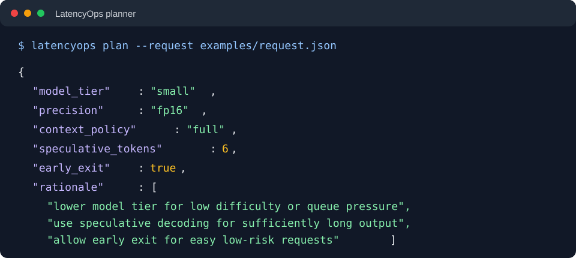

# LatencyOps

LatencyOps is a provider-neutral Python toolkit for measuring AI inference latency and selecting explainable execution policies under latency and quality constraints.

It is a lightweight policy and measurement layer that composes with OpenAI-compatible model endpoints and existing infrastructure. It does not contain model weights or replace OpenAI, LiteLLM, vLLM, SGLang, Hugging Face, or a production edge gateway.

## Why use LatencyOps?

Most inference applications send every request to one model with one fixed execution policy. LatencyOps makes the execution decision per request using:

- Deadline and optional TTFT/TPOT targets
- Quality floor and risk class
- Prompt and expected-output token counts
- Difficulty and context length
- Queue and cache pressure when runtime metrics are available
- Provider health and observed latency/quality

The planner returns an explainable execution plan, provider capability enforcement makes unsupported controls visible, and the benchmark layer measures TTFT, TPOT, end-to-end latency, p50, and p95.

A single planner can serve one application, a batch of any number of analyses, or many agents in a multi-agent workflow. The host application remains responsible for task decomposition, agent memory, tools, retries, and final aggregation. Detailed architecture notes are maintained separately for internal design review and are not part of the public README.

## Where LatencyOps sits

```text
Your application / agent workflow
              |
              | Python library import or HTTP request
              v
+-----------------------------------------------+
| LatencyOps public policy + measurement layer  |
| planner | capability enforcement | routing    |
| TTFT | TPOT | end-to-end | content-free data |
+----------------------+------------------------+
                       |
                       v
       OpenAI-compatible provider endpoint
   OpenAI | LiteLLM | vLLM | SGLang | Hugging Face
                       |
                       v
                 model response

Optional runtime metrics from vLLM, SGLang, or
TensorRT-LLM feed queue/cache/health signals back
into the LatencyOps planner.
```

LatencyOps sits between the application or agent workflow and the model-serving endpoint. It can run in-process as a Python library or as an internal gateway; it is not the model server and it is not an agent framework.

## Core capabilities

- Request latency and quality contracts
- Content-free request profiles and telemetry
- Conservative model-tier and precision planning
- Long-context, cache-pressure, speculation, and early-exit policy signals
- Provider-neutral routing and adaptive provider selection
- OpenAI-compatible completion and chat adapters
- Streaming TTFT and TPOT measurement
- Capability-aware requested-versus-enforced plans
- Optional vLLM, SGLang, and TensorRT-LLM runtime signal normalization
- Static-baseline comparisons and workload benchmarking
- Optional quality outcome hooks and safe re-planning
- Local reference gateway for Python and non-Python clients

The current release is a dependency-light alpha/reference implementation suitable for development and controlled integration testing. It is not a hardened production serving platform.

See also:

- [`COMPARISON_WITH_EXISTING_TOOLS.md`](COMPARISON_WITH_EXISTING_TOOLS.md) for market comparison and community/commercial boundaries
- [`SECURITY.md`](SECURITY.md) for safe operation and reporting
- [`CONTRIBUTING.md`](CONTRIBUTING.md) for development and release verification
- [`DEPLOYMENT.md`](DEPLOYMENT.md) for the reference gateway deployment model
- [`docs/BENCHMARK_REPORT.md`](docs/BENCHMARK_REPORT.md) for sample methodology and aggregate results

## Terminal demo

This example uses the sanitized [`examples/request.json`](examples/request.json) file and does not require a model endpoint:



PowerShell (Windows):

```powershell
python -m pip install latencyops
latencyops plan --request examples\request.json
```

Ubuntu (bash):

```bash
python3 -m pip install latencyops
latencyops plan --request examples/request.json
```

## Support and contact

- Report bugs through [GitHub Issues](https://github.com/hskapasi/latencyops/issues).
- Request features through GitHub Issues using the feature-request template.
- Use GitHub Discussions for usage questions and design discussions when enabled.
- Report security vulnerabilities privately according to [`SECURITY.md`](SECURITY.md), not through a public issue.

## Install and run

LatencyOps requires Python 3.12 or newer.

### From a GitHub checkout

PowerShell (Windows):

```powershell
python -m pip install .
latencyops --help
```

Ubuntu (bash):

```bash
python3 -m pip install .
latencyops --help
```

For development, use an editable install.

PowerShell (Windows):

```powershell
python -m pip install -e .
```

Ubuntu (bash):

```bash
python3 -m pip install -e .
```

The runtime uses the Python standard library. Model-serving systems and credentials remain external.

### From a wheel

After building or downloading a release artifact:

PowerShell (Windows):

```powershell
python -m pip install dist\latencyops-0.1.2-py3-none-any.whl
```

Ubuntu (bash):

```bash
python3 -m pip install dist/latencyops-0.1.2-py3-none-any.whl
```

### From PyPI

After the package is published to PyPI:

PowerShell (Windows):

```powershell
python -m pip install latencyops
```

Ubuntu (bash):

```bash
python3 -m pip install latencyops
```

The package is locally verified but has not yet been published to PyPI.

## Plan without a model endpoint

Create `request.json`:

```json
{
  "prompt_tokens": 100,
  "expected_output_tokens": 32,
  "difficulty": 0.2,
  "queue_pressure": 0.1,
  "cache_pressure": 0.1,
  "quality_floor": 0.9,
  "risk_class": "low",
  "deadline_ms": 1000
}
```

Run the installed planner.

PowerShell (Windows):

```powershell
latencyops plan --request request.json
```

Ubuntu (bash):

```bash
latencyops plan --request request.json
```

This returns an explainable plan without calling a model endpoint.

## Verified real model coverage

These are the real model paths explicitly verified in the current controlled test record. They are endpoint and latency checks, not a general model-quality ranking.

| Provider | Exact model ID | Route | Verified coverage | Runtime signal status |
|---|---|---|---|---|
| OpenAI | `gpt-4o-mini` | OpenAI-compatible OpenAI API | Model discovery and streaming smoke test with TTFT, TPOT, and end-to-end measurement | OpenAI API-level signals only |
| Qwen | `Qwen/Qwen3.6-35B-A3B-FP8` | LiteLLM → Qwen vLLM deployment | Authenticated model discovery, streaming smoke test, proactive request path, TTFT, TPOT, and end-to-end measurement | Direct vLLM queue/KV-cache metrics were not available through the public proxy; real tests use synthetic `SystemSignals` for planning |

The recorded Qwen smoke result was a successful `Hello!` response with TTFT `743.01 ms`, TPOT `8.22 ms`, and end-to-end latency `751.23 ms`. These values are workload-, region-, time-, and deployment-dependent and are not performance guarantees.

### Sample streaming comparison

The following sanitized aggregate is provided as an example reference. It was generated on 2026-09-03 using a synthetic single-sentence streaming workload, three runs per model, and no retained prompt or response content.

| Provider | Model | Runs | Success | TTFT p50 / p95 | TPOT p50 | End-to-end p50 / p95 |
|---|---|---:|---:|---:|---:|---:|
| OpenAI | `gpt-4o-mini` | 3 | 100% | 935.19 / 1634.29 ms | 7.58 ms | 939.58 / 1643.24 ms |
| OpenAI | `gpt-4.1-mini` | 3 | 100% | 753.22 / 945.96 ms | 8.82 ms | 760.25 / 954.65 ms |
| OpenAI | `gpt-5-mini` | 3 | 100% | 1859.08 / 1901.65 ms | 8.58 ms | 1867.66 / 1913.66 ms |
| Qwen | `Qwen/Qwen3.6-35B-A3B-FP8` | 3 | 100% | 750.39 / 809.08 ms | 6.39 ms | 758.88 / 815.68 ms |

These values are illustrative observations from one client, region, workload, and deployment window. They are not model-quality scores, service-level guarantees, or a substitute for running the workload against the reader's own account and endpoint.

## Configured comparison candidates

These IDs are configured as comparison or example candidates. A configured model ID is not evidence of a successful test; verify availability through the authenticated `/v1/models` response first.

| Provider | Model ID | Status |
|---|---|---|
| OpenAI | `gpt-4.1-mini` | Configured comparison candidate |
| OpenAI | `gpt-5-mini` | Configured comparison candidate |
| Qwen | `Qwen/Qwen3.5-9B` | Example configuration candidate |
| Qwen | `Qwen/Qwen3.6-35B-A3B` | Example configuration candidate |

## How users can use it

### Python application or evaluation job

Embed the planner in an existing Python service when you want direct control over the request lifecycle. Give each analysis item or agent task its own deadline, quality floor, risk class, and workload profile.

### Many analyses through one system

Use one planner or gateway for document analysis, research pipelines, support classification, batch evaluation, or other workloads with different request requirements. LatencyOps can select different plans per item instead of forcing every item through one global model policy.

### Multi-agent workflow

Use LatencyOps as a shared execution control plane for research, extraction, review, synthesis, or other agents. Each agent can have a different quality and deadline contract while the application retains responsibility for agent coordination and memory.

### Optional HTTP gateway

Use the gateway when multiple applications or non-Python clients need one internal policy and telemetry endpoint. Place it behind an authenticated TLS-capable edge proxy before controlled deployment.

## Synthetic gateway example

The example starts a local gateway with deterministic providers and no credentials.

PowerShell (Windows):

```powershell
$env:PYTHONPATH = "src"
python examples\synthetic_gateway.py
```

Ubuntu (bash):

```bash
export PYTHONPATH=src
python3 examples/synthetic_gateway.py
```

A completion can then be sent to `http://127.0.0.1:8080/v1/completions`, and measurements are available at `http://127.0.0.1:8080/metrics`.

## Optional configured gateway

Copy `latencyops.example.toml` to a private TOML file, set the environment variables named by `api_key_env`, and start the gateway.

PowerShell (Windows):

```powershell
latencyops gateway --config latencyops.toml
```

Ubuntu (bash):

```bash
latencyops gateway --config latencyops.toml
```

Clients can call `POST /v1/completions`; inspect `GET /metrics` for content-free measurements.

## Real endpoint tests

The real-endpoint probe reads an external dotenv file, prints only the endpoint, credential variable name, model IDs, and measured results, and never prints the credential. Set `LATENCYOPS_ENV_FILE` and `LATENCYOPS_RESULTS_DIR` to paths outside the repository. If unset, the examples use `~/.latencyops/.env` and `~/.latencyops/results`. Use approved credentials and synthetic or approved evaluation data.

PowerShell (Windows):

```powershell
$env:LATENCYOPS_ENV_FILE = "C:\path\to\private\latencyops\.env"
$env:LATENCYOPS_RESULTS_DIR = "C:\path\to\private\latencyops\results"
$env:PYTHONPATH = "src"
python examples\real_endpoint_test.py
python examples\real_endpoint_test.py --smoke --model "approved-model-id"
python examples\compare_real_endpoints.py
```

Ubuntu (bash):

```bash
export LATENCYOPS_ENV_FILE="/path/to/private/latencyops/.env"
export LATENCYOPS_RESULTS_DIR="/path/to/private/latencyops/results"
export PYTHONPATH=src
python3 examples/real_endpoint_test.py
python3 examples/real_endpoint_test.py --smoke --model "approved-model-id"
python3 examples/compare_real_endpoints.py
```

The comparison defaults to `gpt-4o-mini`, `gpt-4.1-mini`, `gpt-5-mini`, and the configured Qwen model. Override the OpenAI set without changing source files.

PowerShell (Windows):

```powershell
$env:LATENCYOPS_OPENAI_MODELS = "gpt-4o-mini,gpt-4.1-mini"
$env:LATENCYOPS_KEY_NAME = "QWEN_API_KEY"
```

Ubuntu (bash):

```bash
export LATENCYOPS_OPENAI_MODELS="gpt-4o-mini,gpt-4.1-mini"
export LATENCYOPS_KEY_NAME="QWEN_API_KEY"
```

The public workload runner tests eight OpenAI categories: factual, extraction, JSON, summarization, code, classification, reasoning, and safety.

## Local verification

PowerShell (Windows):

```powershell
python -m unittest discover -s tests -v
python -m compileall -q src tests examples
```

Ubuntu (bash):

```bash
python3 -m unittest discover -s tests -v
python3 -m compileall -q src tests examples
```

## Security and limitations

- Do not place API keys, customer data, proprietary prompts, or production configuration in this repository.
- Do not expose the reference gateway directly to an untrusted network.
- Use an authenticated TLS-capable edge proxy for controlled deployment.
- Queue and cache signals are real only when a configured metrics endpoint supplies them.
- Provider-specific controls are only applied when the provider advertises support.
- The package does not include model weights, GPU runtimes, hosted inference, durable queues, cancellation, circuit breakers, production backpressure, billing integration, or a complete quality evaluator.

See [`SECURITY.md`](SECURITY.md) and [`DEPLOYMENT.md`](DEPLOYMENT.md) before deployment.
